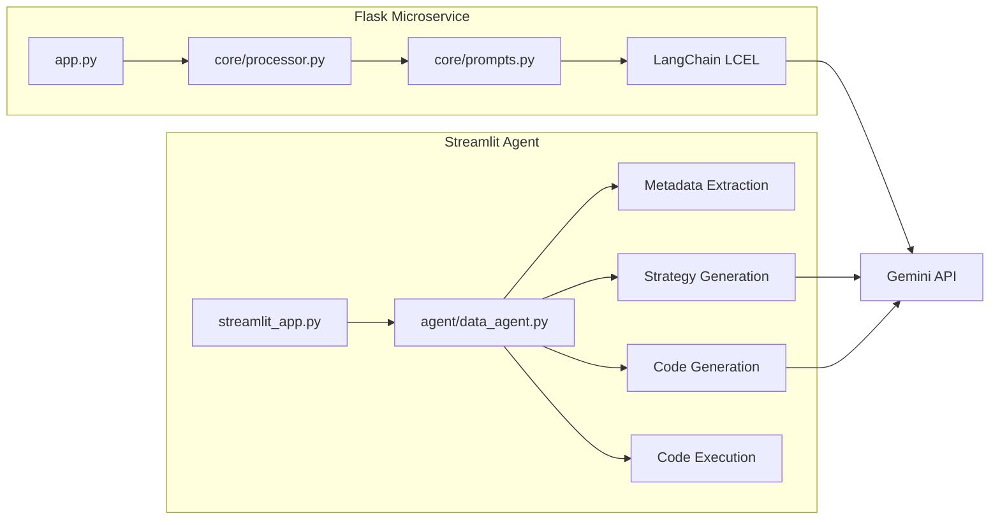
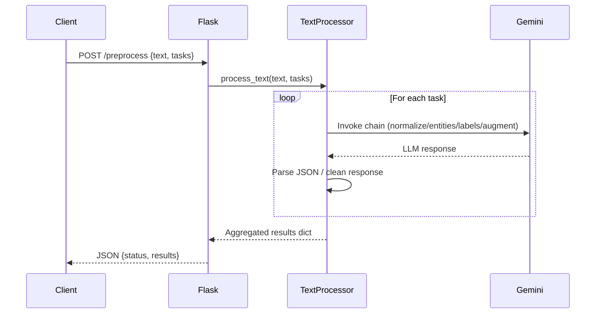
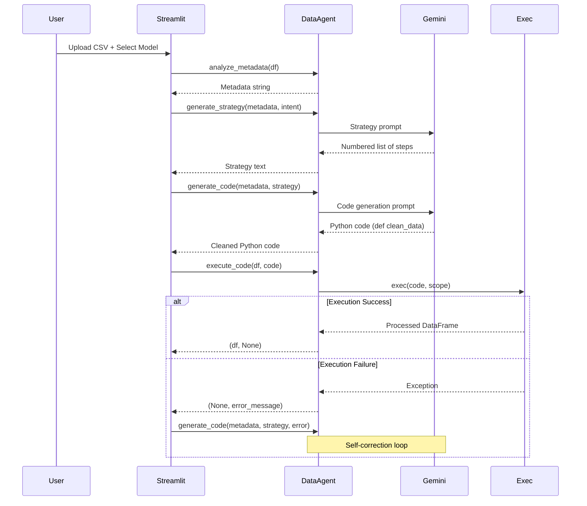

# Architecture Documentation

This document provides an in-depth technical overview of the LLM-Powered Preprocessing Pipeline.

---

## Table of Contents
1. [System Architecture](#system-architecture)
2. [Data Flow](#data-flow)
3. [Component Details](#component-details)
4. [Prompt Engineering](#prompt-engineering)
5. [Execution Model](#execution-model)
6. [Error Handling](#error-handling)
7. [Performance Considerations](#performance-considerations)

---

## 1. System Architecture

### High-Level Design

The system consists of two independent applications sharing the LLM backend:

```
┌─────────────────────────────────────────────────────────────┐
│                    Google Gemini API                        │
│                  (gemini-flash-latest)                      │
└──────────────┬──────────────────────────┬───────────────────┘
               │                          │
       ┌───────▼──────────┐      ┌───────▼──────────┐
       │   Flask API      │      │ Streamlit Agent  │
       │   (Port 5001)    │      │   (Port 8502)    │
       └──────────────────┘      └──────────────────┘
```

### Component Diagram



---

## 2. Data Flow

### Flask API Flow



**Key Points:**
- Each task (normalize, entities, etc.) is an independent chain invocation
- Processing happens sequentially, not in parallel (to avoid rate limits)
- JSON responses are cleaned (remove markdown code blocks) before parsing

### Streamlit Agent Flow



---

## 3. Component Details

### 3.1 Flask API Components

#### `app.py`
- **Responsibility**: HTTP routing, request/response handling
- **Key Functions**:
  - `health_check()`: Simple health endpoint
  - `preprocess()`: Main endpoint, validates input and delegates to `TextProcessor`

#### `core/processor.py`
- **Responsibility**: LLM orchestration for text preprocessing
- **Class**: `TextProcessor`
  - `__init__`: Initializes Gemini LLM and creates LCEL chains
  - `process_text(text, tasks)`: Executes requested preprocessing tasks
- **Design Pattern**: Uses LangChain Expression Language (LCEL) chains (`prompt | llm | parser`)

#### `core/prompts.py`
- **Responsibility**: Prompt template definitions
- **Templates**:
  - `normalization_prompt`: Grammar correction, contraction expansion
  - `entity_extraction_prompt`: NER for PERSON, ORG, LOCATION, DATE, PRODUCT
  - `label_suggestion_prompt`: Zero-shot categorization
  - `feature_augmentation_prompt`: Sentiment + summary generation

### 3.2 Streamlit Agent Components

#### `streamlit_app.py`
- **Responsibility**: UI rendering, user interaction, workflow orchestration
- **Layout**: Tab-based interface (Data Inspection | Agent Workflow | Results)
- **State Management**: Uses `st.session_state` to persist dataframes and code across reruns

#### `agent/data_agent.py`
- **Class**: `DataAgent`
- **Methods**:
  - `analyze_metadata(df)`: Extracts `df.info()`, `df.describe()`, and `df.head()` as text
  - `generate_strategy(metadata, user_intent)`: Prompts LLM for preprocessing steps
  - `generate_code(metadata, strategy, previous_error=None)`: Generates Python function
  - `execute_code(df, code)`: Uses `exec()` to run generated code in a sandboxed scope

---

## 4. Prompt Engineering

### Strategy Generation Prompt Structure

```
You are a Senior Data Scientist.

**Dataset Metadata:**
{metadata}

**User Intent (Target Model):**
{user_intent}

**Task:**
List the specific preprocessing steps...

**Considerations:**
1. Missing Values: ...
2. Categorical Encoding: ...
3. Feature Scaling: CRITICAL for distance-based models...
...
```

**Why This Works:**
- **Role Priming**: "Senior Data Scientist" sets the expertise level
- **Explicit Considerations**: Guides the LLM to think about critical aspects
- **Structured Output**: Requests numbered list for clarity

### Code Generation Prompt Structure

```
You are an expert Python Data Engineer.

**Dataset Metadata:**
{metadata}

**Preprocessing Strategy:**
{strategy}

**Task:**
Write a robust Python function `def clean_data(df):` ...

**Constraints:**
1. Use ONLY pandas and scikit-learn
2. Prefer Pipeline and ColumnTransformer
...

{error_context}  # Only present during self-correction
```

**Key Constraints:**
- **Library Restriction**: Prevents hallucinated dependencies
- **Defensive Coding**: Prompts for existence checks before dropping columns
- **No Markdown**: Explicitly requests plain Python to avoid parsing issues

---

## 5. Execution Model

### The `exec()` Challenge

**Problem**: When using `exec(code, globals(), locals())`, imports defined in `locals()` are not visible to functions defined in the same `exec()` call (they look in `globals()`).

**Original Code**:
```python
local_scope = {'df': df.copy()}
exec(code, globals(), local_scope)  # ❌ Imports invisible to clean_data()
```

**Solution**:
```python
execution_scope = {'df': df.copy()}
exec(code, execution_scope, execution_scope)  # ✅ Shared scope
```

By passing the same dict for both `globals` and `locals`, imports (which go to the local namespace) become visible to function definitions (which search the global namespace).

---

## 6. Error Handling

### Self-Correction Loop

```python
code = generate_code(metadata, strategy)
processed_df, error = execute_code(df, code)

if error:
    # Feed error back to LLM
    code = generate_code(metadata, strategy, previous_error=error)
    processed_df, error = execute_code(df, code)
    
    if error:
        # Give up after one retry
        status.update(state="error")
```

**Why One Retry?**
- Balance between robustness and cost (LLM API calls)
- Most errors are simple (wrong library import, typo)
- Prevents infinite loops

### Error Types Handled

| Error Type | Cause | Self-Correction Strategy |
|-----------|-------|--------------------------|
| `NameError` | Missing import | LLM adds the import |
| `KeyError` | Column doesn't exist | LLM adds defensive check |
| `AttributeError` | Wrong method call | LLM fixes the syntax |
| `TypeError` | Wrong argument type | LLM adjusts the call |

---

## 7. Performance Considerations

### LLM Latency
- **Average Response Time**: 2-5 seconds per LLM call
- **Total Workflow Time**: ~10-20 seconds (metadata → strategy → code → execution)
- **Optimization**: Could parallelize strategy + initial code generation, but risks wasted tokens if strategy changes

### Memory Usage
- **Pandas DataFrame**: Stored in `st.session_state` (could be large)
- **Mitigation**: Streamlit only loads df on file upload, not on every rerun

### Scalability
- **Flask API**: Stateless, can scale horizontally (multiple instances)
- **Streamlit**: Stateful (session-based), requires sticky sessions for load balancing

### Cost Optimization
- **Model Choice**: `gemini-flash-latest` is 10x cheaper than `gemini-pro`
- **Token Usage**: Metadata is truncated (`.head()` not entire df) to reduce prompt size

---

## 8. Security Considerations

### Code Execution Risk

**Threat**: Malicious LLM-generated code could:
- Delete files
- Make network requests
- Exfiltrate data

**Mitigations**:
1. **Prompt Constraints**: Explicitly limit to pandas/sklearn
2. **Sandboxed Scope**: `exec()` runs in isolated namespace (no access to `os`, `sys`, etc.)
3. **No User-Provided Code**: Only CSV data is user input, code is LLM-generated

**Future Improvements**:
- Use `RestrictedPython` for safer execution
- Run exec in a separate process with resource limits

---

## 9. Deployment Architecture

### Production Setup (Recommended)

```
┌─────────────────┐
│   Nginx/Caddy   │  (Reverse Proxy)
└────────┬────────┘
         │
    ┌────▼────┐
    │ Docker  │
    └────┬────┘
         │
    ┌────▼────────────┐
    │ Docker Compose  │
    │  ├── Flask (x3) │  (Gunicorn workers)
    │  └── Streamlit  │
    └─────────────────┘
```

**Components**:
- **Reverse Proxy**: SSL termination, load balancing
- **Flask**: Multiple Gunicorn workers for concurrency
- **Streamlit**: Single instance (stateful)

---

## 10. Future Enhancements

### Planned Features
1. **Streaming Responses**: Use `st.write_stream()` for real-time LLM output
2. **Multi-Model Support**: Let user choose between Gemini, GPT-4, Claude
3. **Caching**: Cache strategy for identical metadata + intent pairs
4. **Versioning**: Track and download different preprocessing versions
5. **Integration**: Export preprocessing logic as sklearn `Pipeline` object

### Technical Debt
- Replace `exec()` with safer alternatives
- Add comprehensive unit tests
- Implement rate limiting for Flask API
- Add monitoring (Prometheus metrics)

---

## Conclusion

This architecture balances:
- **Ease of Use**: Streamlit provides zero-friction UI
- **Flexibility**: LangChain allows easy prompt iteration
- **Safety**: Constrained execution environment
- **Performance**: Fast LLM (Gemini Flash) with efficient prompting

For questions or contributions, see the main [README.md](./README.md).
