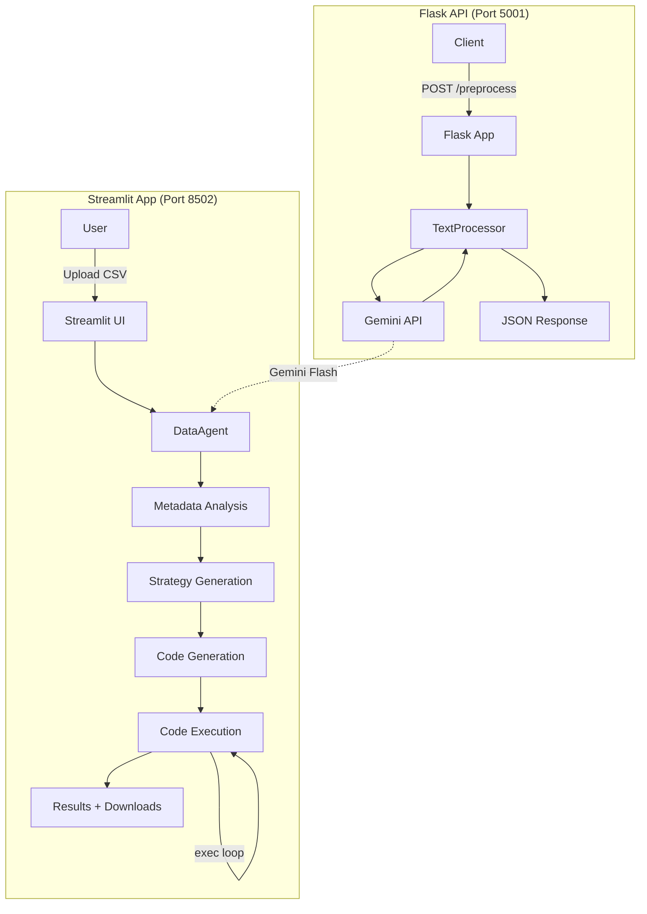

# LLM-Powered Preprocessing Pipeline

An intelligent microservice ecosystem for preprocessing data using LLMs (Google Gemini), featuring both a REST API and an interactive Streamlit application for smart data preparation.

## 🌟 Overview

This project provides two distinct but complementary applications:

### 1. **Flask REST API** - General Text Preprocessing
A microservice that converts raw text/documents into structured ML-ready features using LangChain and Google Gemini.

**Capabilities:**
- Text normalization (grammar correction, standardization)
- Named Entity Recognition (NER)
- Automated label/tag suggestion
- Context-aware feature augmentation (sentiment, summaries)

### 2. **Streamlit Smart Agent** - Tabular Data Preprocessing
An interactive agent that analyzes CSV datasets and generates model-specific preprocessing code.

**Capabilities:**
- Intelligent strategy generation based on target ML model
- Automatic Python code generation (pandas + scikit-learn)
- Self-correction if generated code fails
- Download processed data and reusable preprocessing scripts

---

## 🏗️ Architecture



---

## 🚀 Quick Start

### Prerequisites
- Python 3.9+
- Google Gemini API Key ([Get one here](https://makersuite.google.com/app/apikey))

### Installation

1. **Clone the repository:**
   ```bash
   cd "LLM Powered PreProcessing"
   ```

2. **Install dependencies:**
   ```bash
   pip install -r requirements.txt
   ```

3. **Set up environment variables:**
   ```bash
   cp .env.example .env
   # Edit .env and add your GOOGLE_API_KEY
   ```

### Running the Applications

#### Flask API
```bash
python app.py
```
Access at: `http://localhost:5001`

**Example Request:**
```bash
curl -X POST http://localhost:5001/preprocess \
  -H "Content-Type: application/json" \
  -d '{
    "text": "Apple Inc. announced a new iPhone yesterday.",
    "tasks": ["normalize", "entities", "labels"]
  }'
```

#### Streamlit Smart Agent
```bash
streamlit run streamlit_app.py
```
Access at: `http://localhost:8501` (or `8502` if 8501 is occupied)

**Workflow:**
1. Upload a CSV dataset
2. Select your target ML model (Linear Regression, Random Forest, etc.)
3. Let the agent generate and execute preprocessing code
4. Download processed data and Python script

---

## 📦 Project Structure

```
.
├── app.py                      # Flask REST API entry point
├── streamlit_app.py            # Streamlit agent UI
├── core/
│   ├── processor.py            # Flask API text processing logic
│   └── prompts.py              # Prompt templates for Flask API
├── agent/
│   └── data_agent.py           # Streamlit agent logic (DataAgent class)
├── requirements.txt            # Python dependencies
├── Dockerfile                  # Docker configuration
├── docker-compose.yml          # Multi-container orchestration
├── .env.example                # Template for environment variables
├── README.md                   # This file
├── ARCHITECTURE.md             # Detailed technical documentation
└── deep_dive.md                # Original design document
```

---

## 🛠️ Technologies Used

| Component | Technology | Purpose |
|-----------|-----------|---------|
| **LLM** | Google Gemini (Flash) | Code generation, reasoning, NER |
| **Framework** | LangChain | LLM orchestration, prompt management |
| **API** | Flask | REST API server |
| **UI** | Streamlit | Interactive web interface |
| **Data Processing** | Pandas, Scikit-learn | DataFrame manipulation, ML preprocessing |
| **Containerization** | Docker | Deployment |

---

## 📖 Use Cases

### Flask API Use Cases
- Preprocessing large text datasets for NLP models
- Building data pipelines with entity extraction
- Automated content tagging and categorization

### Streamlit Agent Use Cases
- Exploratory data analysis with automated preprocessing
- Quick prototyping of ML pipelines
- Learning how to preprocess data for specific models
- Generating reusable preprocessing scripts

---

## 🔧 Configuration

### Environment Variables
| Variable | Required | Description |
|----------|----------|-------------|
| `GOOGLE_API_KEY` | ✅ | Your Google Gemini API key |

### Customization
- **Flask API**: Modify prompts in `core/prompts.py` to change preprocessing behavior
- **Streamlit Agent**: Edit `agent/data_agent.py` to adjust strategy generation logic

---

## 🐳 Docker Deployment

```bash
# Build and run
docker-compose up --build

# Flask API will be at: http://localhost:5000
# Add Streamlit service to docker-compose.yml if needed
```

---

## 📊 Example: Streamlit Agent in Action

**Scenario**: You have a messy YouTube statistics dataset with missing values, categorical columns, and want to train a Linear Regression model.

1. Upload `youtube_stats.csv`
2. Select "Linear Regression"
3. Agent analyzes and suggests:
   - Drop irrelevant columns (IDs, high-cardinality text)
   - Impute missing values
   - One-Hot Encode `category_id`
   - StandardScale numerical features
4. Generates and executes robust Python code
5. Downloads `processed_data.csv` (Z-score normalized, encoded, ready for `sklearn.linear_model.LinearRegression`)

---

## 🤝 Contributing

Contributions are welcome! Please ensure:
- Code follows PEP 8
- Prompts are well-documented
- New features include usage examples

---

## 📄 License

MIT License - Feel free to use and modify.

---

## 🙏 Acknowledgments

- **Google Gemini** for powerful LLM capabilities
- **LangChain** for simplifying LLM workflows
- **Streamlit** for making data apps effortless

---

## 📚 Further Reading

- [ARCHITECTURE.md](./ARCHITECTURE.md) - Deep technical dive
- [deep_dive.md](./deep_dive.md) - Original design document
- [LangChain Docs](https://python.langchain.com/)
- [Streamlit Docs](https://docs.streamlit.io/)
