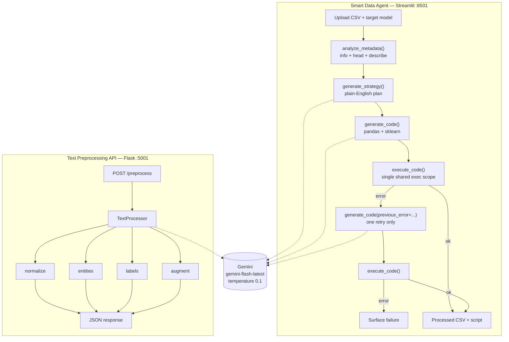

# LLM-Powered Preprocessing Pipeline

**An LLM agent that reads your dataset, decides how to clean it, writes the pandas + scikit-learn code, runs it, and fixes its own mistakes.**

[](https://www.python.org/)
[](https://python.langchain.com/)
[](https://ai.google.dev/)
[](https://flask.palletsprojects.com/)
[](https://streamlit.io/)
[](https://docs.docker.com/compose/)
[](#license)

---

## What this is

Two applications sharing one Gemini backend, aimed at the part of ML work that eats the most time and generates the least insight: preprocessing.

| | **Smart Data Agent** (Streamlit) | **Text Preprocessing API** (Flask) |
|---|---|---|
| **Input** | A CSV file + your target model | Raw text |
| **Output** | Cleaned DataFrame + the Python script that produced it | Structured JSON features |
| **What it does** | Profiles the data, plans a strategy, writes code, executes it, self-corrects on failure | Normalisation, NER, auto-tagging, sentiment + summary |
| **Run it** | `streamlit run streamlit_app.py` | `python app.py` |

The agent is the interesting half. You upload a messy CSV, tell it you want to train a Random Forest, and it hands back both a processed dataset **and** a reusable preprocessing script — so you can read exactly what was done to your data instead of trusting a black box.

---

## Why it's built the way it is

This section is the point of the repo. The code is small; the decisions are the substance.

### 1. Plan first, then write code

The agent never jumps straight from a DataFrame to Python. It runs two separate LLM calls:

```
analyze_metadata(df)  →  generate_strategy(metadata, target_model)  →  generate_code(metadata, strategy)
```

`generate_strategy` produces a numbered plan in plain English, constrained by explicit rules baked into the prompt:

- `OneHotEncoder` for low-cardinality nominal columns
- `TargetEncoder` / `LabelEncoder` for high-cardinality columns, to avoid exploding the feature space into sparsity
- Drop any column more than 50% missing
- Impute the rest

Only then does `generate_code` translate that plan into Python, restricted to pandas and scikit-learn and told to prefer `sklearn.pipeline.Pipeline` and `ColumnTransformer`.

**Why split it?** Because the two calls fail differently. A bad *plan* is a reasoning error you can read and argue with. A bad *code generation* is a syntax error you can catch by executing. Collapsing them into one prompt means a reasoning mistake arrives disguised as a runtime error, and you have no idea which one you're debugging. Splitting them also means the plan is surfaced in the UI before any code runs — you get a veto.

### 2. Self-correction that retries exactly once

When generated code raises, the error text is fed back into the prompt and the model gets **one** attempt to fix it:

```python
processed_df, error = agent.execute_code(df, code)

if error:
    code = agent.generate_code(metadata, strategy, previous_error=error)
    processed_df, error = agent.execute_code(df, code)
    # no third attempt — surface the failure
```

One retry, not N. That is a deliberate bound, not an unfinished loop:

| Failure type | Fixed on retry? |
|---|---|
| `NameError` — missing import | Almost always |
| `KeyError` — hallucinated column name | Usually, once the real schema is echoed back |
| `TypeError` / `AttributeError` — wrong dtype assumption | Often |
| Genuinely bad plan | Never — retrying just burns tokens |

The failures a second retry would catch are mostly the fourth row, and those don't get better with repetition. Capping at one keeps worst-case cost and latency predictable, and guarantees the loop terminates.

### 3. A Python `exec()` scoping bug worth knowing about

The first version of the executor did this:

```python
local_scope = {"df": df.copy()}
exec(code, globals(), local_scope)   # ✗ silently broken
```

Generated code that defined a helper function and called it would blow up with `NameError: name 'pd' is not defined` — even though `import pandas as pd` was right there at the top of the generated code.

**Why:** with separate `globals` and `locals` dicts, the imports land in `local_scope`, but a function *defined* inside that `exec` resolves its free variables against `globals()` at call time. It never sees the locals. The imports are present and invisible at the same time.

The fix is to pass one dictionary as both:

```python
execution_scope = {"df": df.copy()}
exec(code, execution_scope, execution_scope)   # ✓
```

Now module-level and function-level lookups resolve against the same namespace, matching normal module semantics.

### 4. Failures are isolated per task, not per request

The Flask API runs four independent LCEL chains. Each is wrapped separately, so one failing task degrades rather than taking down the whole response:

```python
results["entities_error"] = str(e)
results["entities"] = {}          # caller still gets a usable shape
```

A malformed JSON response from the NER chain doesn't cost you the normalised text you also asked for.

### 5. Send metadata, not data

`analyze_metadata` sends `df.info()`, `df.head()` and `df.describe(include='all')` as text — never the DataFrame. Token cost stays flat whether the CSV has 500 rows or 5 million, and no bulk row data leaves the machine.

### 6. Validate the output contract before trusting it

After execution, the agent asserts that the generated code actually produced what was asked for — a `clean_data` symbol holding a real `pd.DataFrame` — before anything downstream touches it. LLM output is validated at the boundary, not assumed.

---

## Quick start

### Prerequisites
- Python 3.9+
- A Google Gemini API key — free tier is enough ([get one](https://aistudio.google.com/apikey))

### Install

```bash
git clone https://github.com/JRaviShankar2000/LLM-Powered-Data-Preprocessing-Pipeline-.git
cd LLM-Powered-Data-Preprocessing-Pipeline-
python -m venv .venv && source .venv/bin/activate   # Windows: .venv\Scripts\activate
pip install -r requirements.txt
```

### Configure

```bash
cp .env.example .env
```

Then edit `.env`:

```bash
GOOGLE_API_KEY=your_key_here
```

`.env` is gitignored. Never commit it.

### Run the agent

```bash
streamlit run streamlit_app.py
```

Opens on <http://localhost:8501>.

1. Upload a CSV
2. Pick a target model — Linear Regression, Logistic Regression, Random Forest, XGBoost, K-Means, or describe your own intent
3. Watch it profile → plan → generate → execute (→ self-correct, if needed)
4. Download the processed CSV and the generated script from the **Results & Export** tab

### Run the API

```bash
python app.py
```

Serves on <http://localhost:5001>.

---

## API reference

### `GET /health`

```json
{ "status": "healthy" }
```

### `POST /preprocess`

| Field | Type | Required | Description |
|---|---|---|---|
| `text` | string | ✅ | The text to process |
| `tasks` | string[] | — | Subset of `normalize`, `entities`, `labels`, `augment`. Omit to run all four. |

```bash
curl -X POST http://localhost:5001/preprocess \
  -H "Content-Type: application/json" \
  -d '{
    "text": "Apple Inc. announced a new iPhone yesterday.",
    "tasks": ["normalize", "entities", "labels"]
  }'
```

```json
{
  "status": "success",
  "results": {
    "normalized_text": "Apple Inc. announced a new iPhone yesterday.",
    "entities": {
      "PERSON": [],
      "ORGANIZATION": ["Apple Inc."],
      "LOCATION": [],
      "DATE": ["yesterday"],
      "PRODUCT": ["iPhone"]
    },
    "labels": ["Technology", "Consumer Electronics", "Product Launch"]
  }
}
```

**Tasks**

| Task | Returns | Notes |
|---|---|---|
| `normalize` | `normalized_text` | Fixes grammar, expands contractions, strips whitespace, standardises slang — without changing meaning |
| `entities` | `entities` | NER over `PERSON`, `ORGANIZATION`, `LOCATION`, `DATE`, `PRODUCT` |
| `labels` | `labels` | Up to 3 category tags |
| `augment` | `augmentation` | Sentiment and summary |

**Errors** — `400` if `text` is missing, `500` if the processor failed to initialise (usually a missing `GOOGLE_API_KEY`). Per-task failures return `200` with a `<task>_error` key alongside a safe empty default.

---

## Architecture



---

## Project structure

```
.
├── app.py                  # Flask entry point — /health, /preprocess
├── streamlit_app.py        # Agent UI and the self-correction loop
├── core/
│   ├── processor.py        # TextProcessor — 4 LCEL chains, per-task isolation
│   └── prompts.py          # Prompt templates for the API
├── agent/
│   └── data_agent.py       # DataAgent — metadata, strategy, codegen, execution
├── requirements.txt
├── Dockerfile              # python:3.9-slim + gunicorn
├── docker-compose.yml
├── .env.example
├── ARCHITECTURE.md         # Deep technical write-up
├── deep_dive.md            # Original design notes
└── test_api.py             # Manual smoke script (see Limitations)
```

---

## Configuration

| Variable | Required | Description |
|---|---|---|
| `GOOGLE_API_KEY` | ✅ | Google Gemini API key |

**Model:** `gemini-flash-latest` at `temperature=0.1`. Low temperature is intentional — for code generation you want the boring, conventional answer, not a creative one. Flash is roughly an order of magnitude cheaper than Pro per token, and code generation of this kind does not need Pro-level reasoning.

**Tuning points**
- API behaviour → `core/prompts.py`
- Agent strategy rules → `agent/data_agent.py`

---

## Docker

```bash
docker compose up --build
```

Serves the Flask API on <http://localhost:5000>.

`docker compose` substitutes `${GOOGLE_API_KEY}` from your `.env` automatically, so no extra step is needed.

> **Port note:** the Flask dev server runs on **5001**; the container runs gunicorn on **5000**. Only the API is containerised — the Streamlit app runs locally.

---

## Limitations & security

Stated plainly, because this is a portfolio project and the gaps are as informative as the features.

### `exec()` of model-generated code

The agent executes Python that an LLM wrote. Guardrails today are **prompt-level only** — the model is instructed not to use `os.system`, `subprocess`, or other system calls — plus a scoped execution namespace. That is not a sandbox and should not be mistaken for one.

**Run this locally, on your own data.** Do not expose the agent to untrusted uploads or deploy it multi-tenant as-is. Proper isolation means a separate process with dropped privileges, a syscall filter or a disposable container — `RestrictedPython` plus subprocess isolation is the intended direction.

### Known gaps

| Gap | Detail |
|---|---|
| **No test suite** | `test_api.py` is a manual script that posts a request and prints the response. No framework, no assertions, no CI. |
| **No pinned dependencies** | `requirements.txt` lists bare package names. Builds are not reproducible. |
| **`debug=True` in the entry point** | Fine locally, unacceptable if exposed. |
| **No caching or rate limiting** | Every request is a fresh LLM call. |
| **No evaluation harness** | Self-correction success rate is unmeasured. |
| **Port inconsistency** | Dev 5001 vs container 5000. |
| **Quoted timings are estimates** | 2–5 s per LLM call, 10–20 s end to end — observed, not benchmarked. |

---

## Roadmap

- [ ] Pytest suite with assertions, plus GitHub Actions CI
- [ ] Pin every dependency
- [ ] Subprocess isolation for generated-code execution
- [ ] Measure self-correction success rate against a fixture set of deliberately messy CSVs
- [ ] Response caching keyed on a metadata hash
- [ ] Unify ports on 5000 and drop `debug=True`

---

## License

MIT — free to use and modify.

## Acknowledgments

Built with [LangChain](https://python.langchain.com/), [Google Gemini](https://ai.google.dev/) and [Streamlit](https://streamlit.io/).
