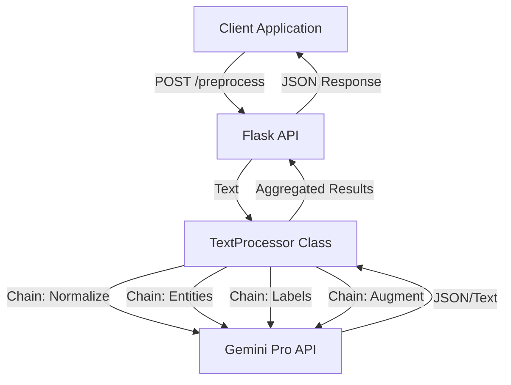

# Deep Dive: LLM-Powered Preprocessing Pipeline

## Overview
This project implements a robust, reusable microservice for preprocessing raw text data into machine-learning-ready features. It leverages Google's Gemini Pro model via LangChain to perform complex semantic tasks that traditional regex-based preprocessing cannot handle.

## Architecture

## Key Components

### 1. Flask Microservice (`app.py`)
- **Role**: Entry point for the application.
- **Endpoints**:
    - `POST /preprocess`: Accepts raw text and a list of tasks. Returns structured JSON.
    - `GET /health`: Health check for container orchestration.
- **Design**: Stateless and container-ready.

### 2. Core Processor (`core/processor.py`)
- **Role**: Orchestrates the interaction with Gemini.
- **Logic**:
    - Initializes `ChatGoogleGenerativeAI` with the provided API key.
    - Manages `LLMChain` instances for each specific task.
    - `process_text` method handles error handling per-task to ensure partial failures don't crash the entire request.

### 3. Prompt Engineering (`core/prompts.py`)
- **Normalization**: Focuses on grammar, whitespace, and standardizing slang without altering meaning.
- **Entity Extraction**: Structured JSON extraction of PERSON, ORG, LOC, DATE, PRODUCT.
- **Label Suggestion**: Zero-shot classification to suggest relevant tags.
- **Feature Augmentation**: Generates sentiment scores and summaries to enrich the dataset.

## Technical Decisions

- **LangChain**: Used for its abstraction over LLM APIs and easy chain management.
- **Gemini Pro**: Chosen for its strong reasoning capabilities and cost-effectiveness.
- **Docker**: Ensures the environment is consistent across development and production.
- **JSON Output**: All prompts are engineered to return strict JSON (or are parsed as such) to ensure downstream ML models can ingest the data easily.

## Extensibility
To add a new preprocessing task (e.g., "Translation"):
1.  Define a new `PromptTemplate` in `core/prompts.py`.
2.  Add a new chain in `TextProcessor.__init__`.
3.  Add handling logic in `TextProcessor.process_text`.

## Security
- API Keys are managed via environment variables (`.env`).
- No data is persisted in the microservice (stateless).
